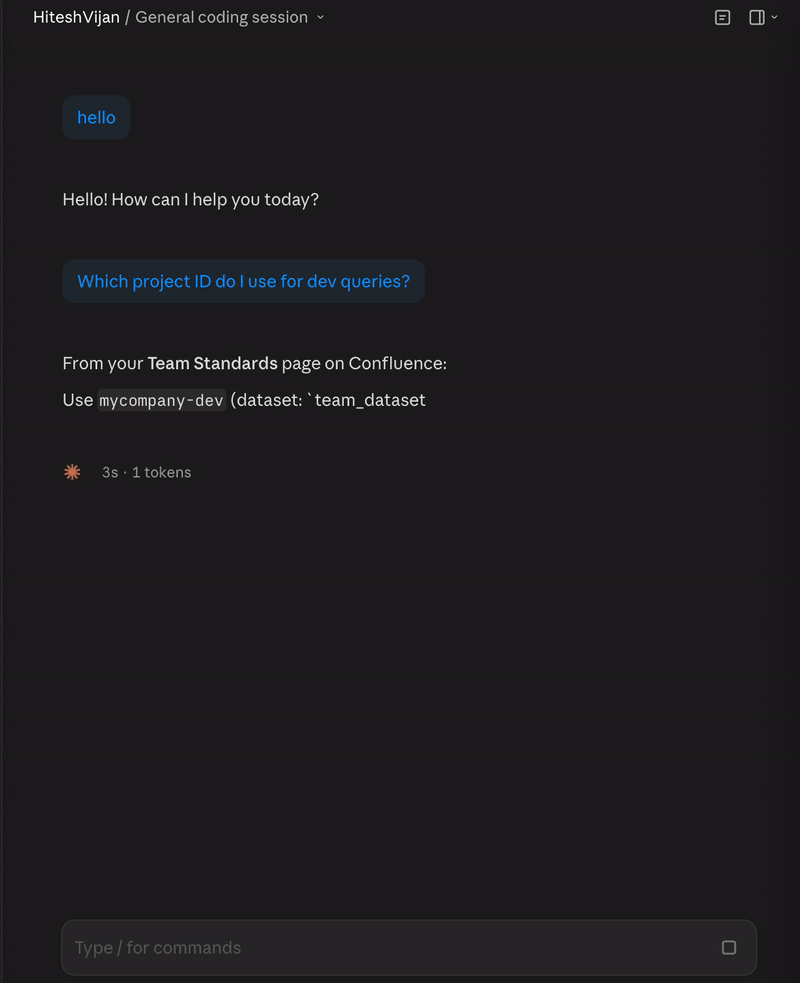
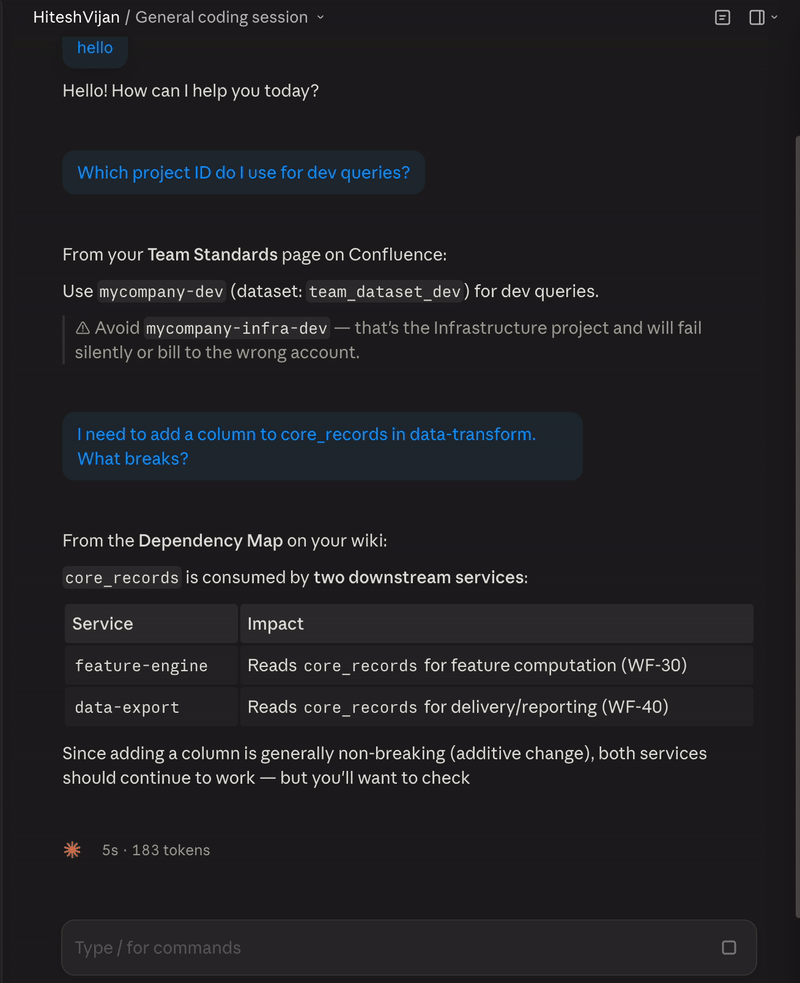
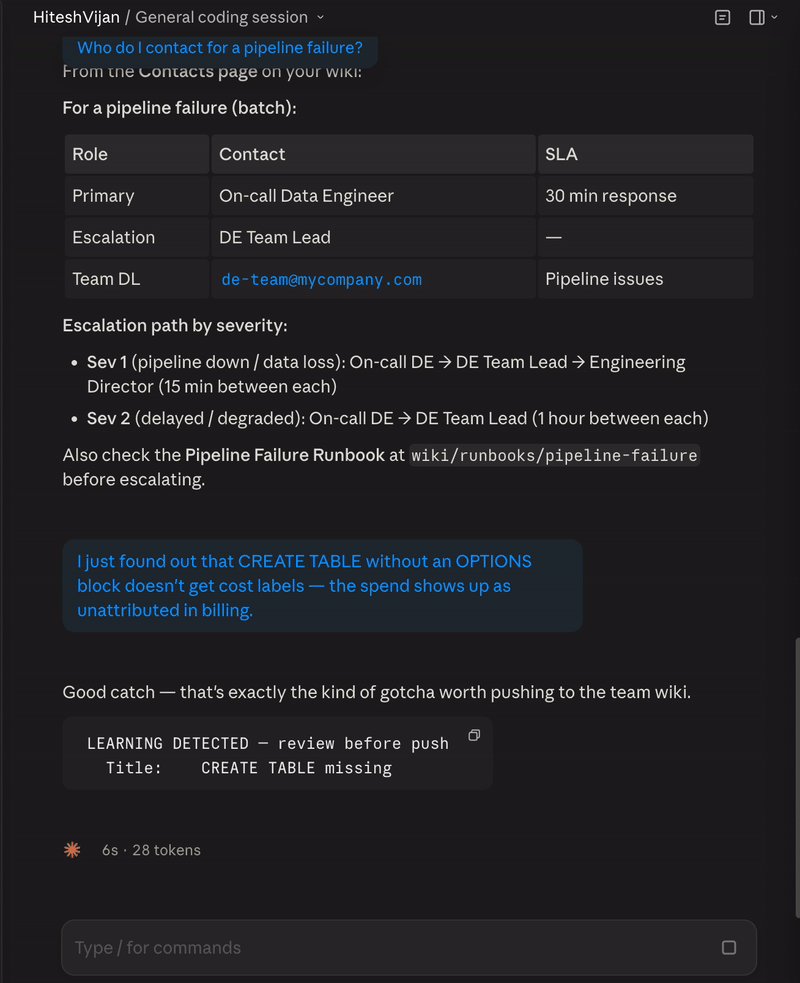
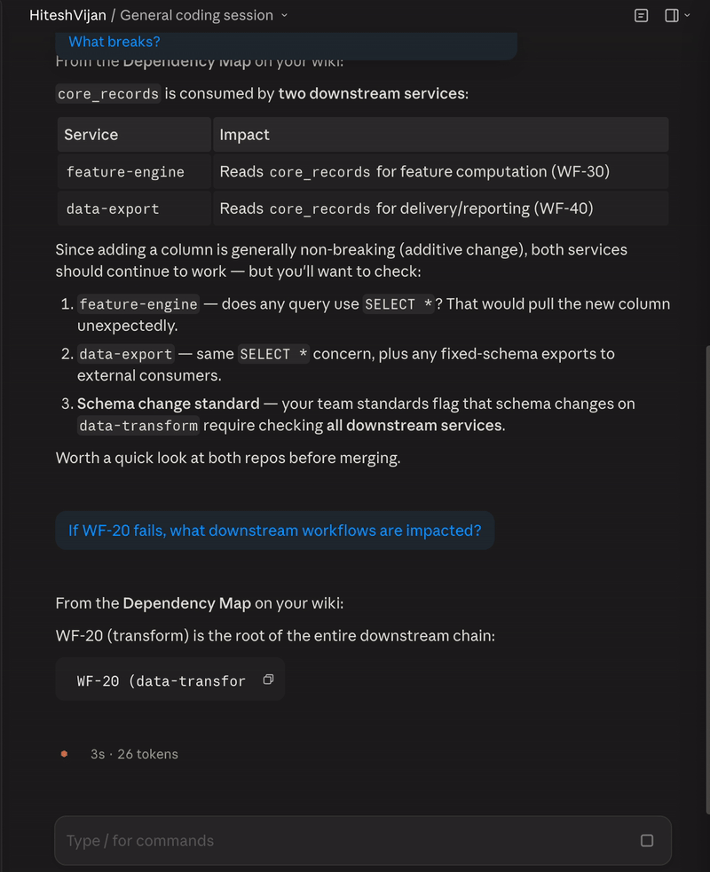
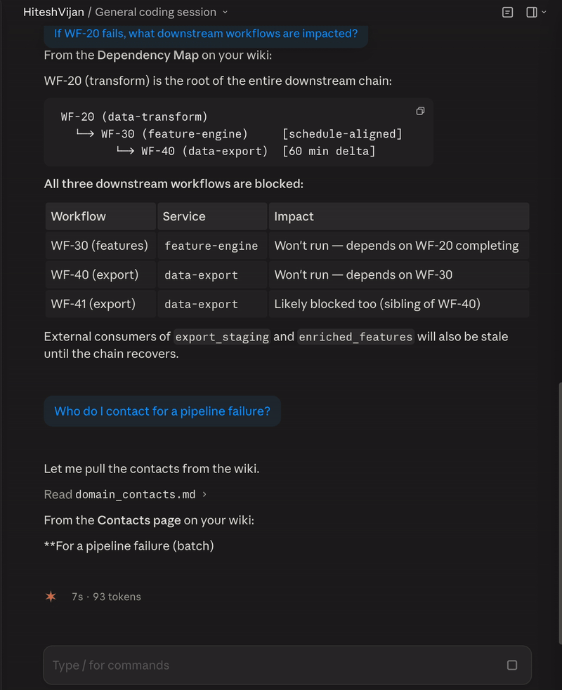
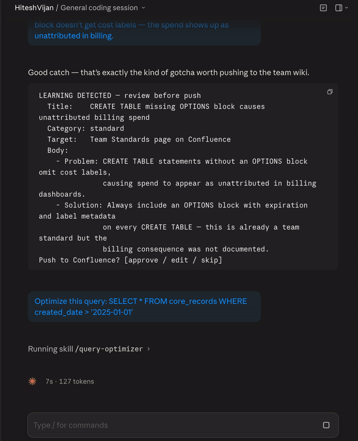

<p align="center">
  <picture>
    <source media="(prefers-color-scheme: dark)" srcset="assets/banner.svg">
    <source media="(prefers-color-scheme: light)" srcset="assets/banner-light.svg">
    
  </picture>
</p>

<p align="center">
  <strong>Your team's institutional knowledge — auto-loaded into every Claude Code session.</strong>
</p>

<p align="center">
  <a href="https://github.com/HiteshVijan/claude-team-memory/stargazers"></a>
  <a href="LICENSE"></a>
  <a href="#quick-start"></a>
  <a href="docs/architecture.md"></a>
</p>

---

## The Problem

Every AI memory tool solves the same thing: **one developer's preferences.** Teams have a harder problem.

Your team's institutional knowledge — coding standards, service dependencies, contact directories, pipeline runbooks — is scattered across Confluence pages, SOPs, and one senior engineer's brain. None of it reaches the AI session. Every morning, every engineer re-explains the same context from scratch.

```
Monday morning. 5 engineers. Same team. Same codebase.

Engineer A: "Which project ID do I use?"                  → Claude gives the wrong one
Engineer B: "Who do I contact for pipeline failures?"     → Claude doesn't know
Engineer C: "What breaks if I change this table?"         → Claude has no cross-repo context
Engineer D: Just joined the team last week                → Starts from absolute zero
Engineer E: Debugged this exact issue 3 weeks ago         → Knowledge died with the session
```

Context Memory fixes this. Structure your team knowledge into wiki pages, and the framework **auto-loads it into every Claude Code session** — pull from wiki, cache locally, push learnings back. No database, no MCP server. Just files and a hook.

**Every team member's Claude starts with the same enterprise knowledge baseline, from Day 1.**

---

## Demo

**Standards recall** — Claude answers from your wiki, not from training data:



**Dependency awareness** — knows what breaks across repos before you push:



**Knowledge push-back** — detects learnings and proposes wiki updates:



<details>
<summary><strong>See all 6 demo prompts</strong></summary>

**Failure cascade analysis:**



**Contact lookup from wiki:**



**Skill auto-routing:**



</details>

---

## How It Works

```
┌─────────────────────────────────────────────────────────────┐
│  Tier 1: Team Standards                        ALWAYS ON   │
│  Coding rules, env config, branch strategy    (~50 lines)  │
├─────────────────────────────────────────────────────────────┤
│  Tier 2: Dependency Map                        ALWAYS ON   │
│  Repo registry, workflow graph, table lineage (~200 lines) │
├─────────────────────────────────────────────────────────────┤
│  Tier 3: Module Detail                         ON-DEMAND   │
│  Per-repo task chains, file listings, config  (~100/repo)  │
├─────────────────────────────────────────────────────────────┤
│  Tier 4: On-Demand References                  LAZY LOAD   │
│  Domain standards, runbooks, contacts         (as needed)  │
└─────────────────────────────────────────────────────────────┘

~410 lines always loaded. Tiers 3-4 loaded on-demand via Read tool.
```

On every session start, a hook pulls your wiki pages, caches them locally, and assembles `team_knowledge.md`. CLAUDE.md `@`-imports load it into context. When Claude discovers a reusable learning, it proposes pushing it back to the wiki — human-approved, categorized, routed to the right page.

> **Deep dive:** [Architecture](docs/architecture.md) · [Tutorial](docs/tutorial.md)

---

## Quick Start

```bash
bash <(curl -fsSL https://raw.githubusercontent.com/HiteshVijan/claude-team-memory/main/scripts/quick-install.sh)
```

Or step by step:

```bash
git clone https://github.com/HiteshVijan/claude-team-memory.git ~/.claude/repos/claude-team-memory
cd ~/.claude/repos/claude-team-memory && bash framework/install.sh
cp examples/knowledge-pages.json ~/.claude/knowledge-pages.json
# Edit with your Confluence page IDs

mkdir -p ~/.config/confluence
cat > ~/.config/confluence/.env << 'EOF'
CONFLUENCE_BASE_URL=https://your-org.atlassian.net
CONFLUENCE_USERNAME=your.email@company.com
CONFLUENCE_API_TOKEN=your-api-token
EOF

bash ~/.claude/scripts/pull_knowledge.sh
```

Start a new Claude Code session — your team knowledge loads automatically.

> **Detailed walkthrough:** [30-minute tutorial](docs/tutorial.md)

---

## Results

From daily use across a multi-repo engineering ecosystem:

| Metric | Before | After |
|--------|--------|-------|
| Session setup | 10-15 min re-explaining context | **~0** (auto-loaded) |
| Wrong environment errors | Weekly | **Near zero** |
| New teammate onboarding | ~2 weeks | **Day 1** |
| Knowledge retention | Lost when session ends | **Pushed back to wiki** |
| AI consistency | Different answers per person | **Same baseline for everyone** |

---

## Contributing

Wiki adapters (Notion, GitBook, SharePoint), tool adapters (Cursor, Copilot, Codex), and team packs welcome. See [CONTRIBUTING.md](CONTRIBUTING.md) and [open issues](https://github.com/HiteshVijan/claude-team-memory/issues).

---

<p align="center">
  <a href="LICENSE"></a>
</p>

<p align="center">
  <em>Built by engineers who got tired of re-explaining the same things to AI every morning.</em>
</p>

<p align="center">
  <a href="docs/tutorial.md">Tutorial</a> &bull;
  <a href="docs/architecture.md">Architecture</a> &bull;
  <a href="CONTRIBUTING.md">Contributing</a>
</p>
